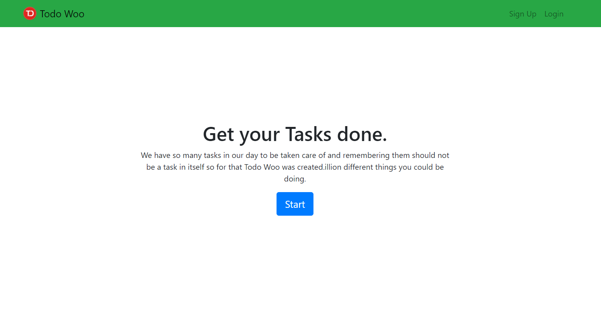
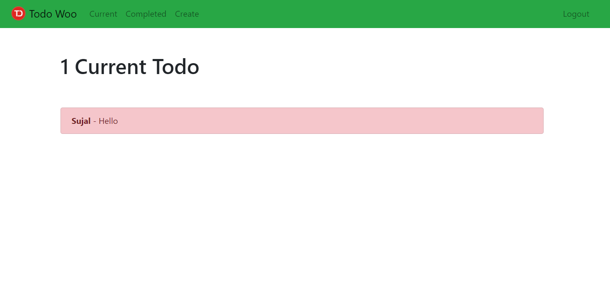

# Todo Web App with Django framework

We have so many tasks in our day to be taken care of and remembering them should not be a task in itself so for that Todo Woo was created.
There are now a million different things you could be doing.

